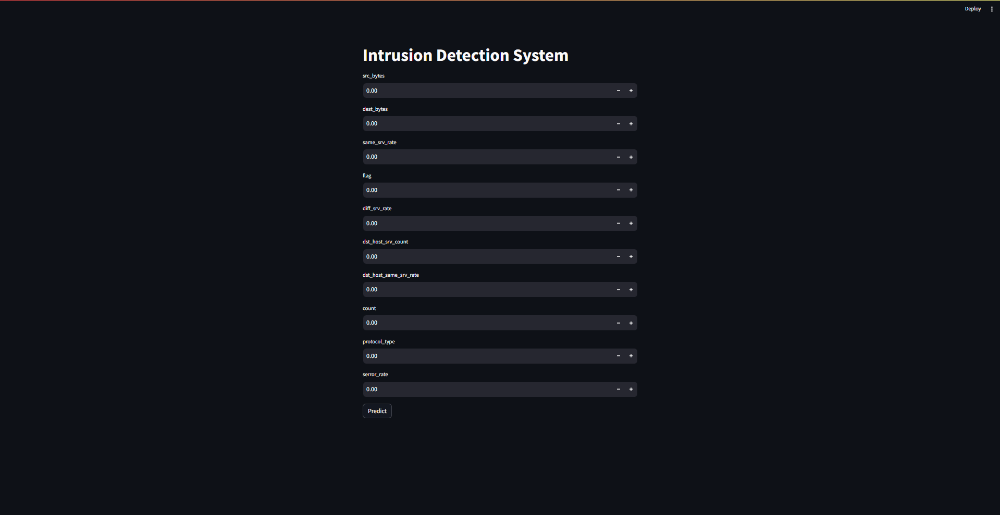

# INTRUSION DETECTION MACHINE LEARNING PROJECT

> MEMBERS: 

> HARISH SENTHILKUMARAN DHARANI - 22011103017

> M K LOKESH KUMAR - 22011103026

## INTRODUCTION

This project focuses on developing and machine learning models for intrusion detection in network traffic. The data set we used contains various features like src_bytes, dst_bytes, flag, count, logged_in. The aim is to build different predictive models and determine the model with the best precision and accuracy.

## MODEL PREPARATION

- LABEL ENCODING - Before training the models, categorical variables such as 'protocol_type', 'service', 'flag', and 'class' were encoded using label encoding. This transformation converts categorical labels into numerical values, making them suitable for machine learning algorithms.

- FEATURE SELECTION - We employed Random Forest Classifier (RFC) to identify the 10 most important features with the highest importance scores for further analysis and model training. The features are :
    - src_bytes
    - dst_bytes
    - flag
    - dst_host_srv_count
    - diff_srv_rate
    - same_srv_rate
    - logged_in
    - protocol_type
    - count
    - dst_host_same_srv_rate

- DATA SPLITTING - The dataset was split into training and testing sets. The training set, comprising 80% of the data, was used to train the models, while the remaining 20% served as a holdout test set for evaluating model performance.

## MODELS USED

- Logistic Regression: A linear model used for binary classification tasks, logistic regression is well-suited for this project's task of classifying network traffic as normal or intrusive based on the extracted features.
    - precision : 0.8956142091684858
    - accuracy : 0.8698347107438017
    - recall : 0.9446522064323112
    - f1 score : 0.9057009680889208
    - confusion matrix : [[1987  378]
                          [ 148 2526]]

- XGBoost (Extreme Gradient Boosting): XGBoost is a powerful gradient boosting algorithm known for its high performance and scalability. It is employed here to handle complex relationships in the data and improve predictive accuracy
    - precision : 0.9972216709664616
    - accuracy : 0.9977544910179641
    - recall : 0.9970082273747195
    - f1 score : 0.9973812196034418
    - confusion matrix : [[2359  6]
                          [ 8 2666]]

- Decision Tree: Decision trees offer interpretable models and are capable of capturing nonlinear relationships in the data. In this project, decision trees are used to explore feature importance and reduce dimensionality.

- Gaussian Naive Bayes: Naive Bayes classifiers are probabilistic models based on Bayes' theorem with the assumption of independence between features. Gaussian Naive Bayes, specifically, is applied here for its simplicity and efficiency in handling continuous input features.

## FURTHER FEATURE REDUCTION

-For Logistic Regression and XGBoost models, we first trained separate models without feature reduction. After training, we applied RFECV (Recursive Feature Elimination using Cross-Validation) to the trained models to identify the optimal subset of features.

- Logistic Regression
    - Optimal Subset of Features : 
        - flag 
        - diff_srv_rate 
        - same_srv_rate 
        - logged_in 
        - protocol_type
        - dst_host_same_srv_rate
    - Metrics : 
        - precision : 0.944433419329232
        - accuracy : 0.9469753547423451
        - recall : 0.9483919222139118
        - f1 score : 0.9476831091180867
        - confusion matrix : [[2223  142]
                              [ 138 2536]]

- XGBoost
    - Optimal Subset of Features : 
        - src_bytes
        - dst_bytes
        - flag
        - dst_host_srv_count
        - dst_host_diff_srv_rate
        - diff_srv_rate
        - count
        - dst_host_same_srv_rate
        - dst_host_same_src_port_rate
    - Metrics : 
        - precision : 0.9972216709664616
        - accuracy : 0.9966392830470501
        - recall : 0.9981301421091997
        - f1 score : 0.9973841554559043
        - confusion matrix : [[2356 9]
                              [ 5 2669]]

- For the Decision Tree classifier, we directly utilized RFECV during the feature selection process to identify the optimal subset of features and for Gaussian Naive Bayes, we directly employed SelectKBest without the need for separate model training.

- Decision Tree Classifier
    - Optimal Subset of Features : 
        - src_bytes
        - dst_bytes
        - flag
        - dst_host_srv_count
        - dst_host_diff_srv_rate
        - diff_srv_rate
        - count
        - dst_host_same_srv_rate
        - dst_host_same_src_port_rate
    - Metrics : 
        - precision : 0.994244889859099
        - accuracy : 0.9940231602540157
        - recall : 0.9951383694839192
        - f1 score : 0.9945804522519155
        - confusion matrix : [[2349 16]
                              [ 13 2661]]

- Naive Bayes
    - Optimal Subset of Features : 
        - src_bytes
        - dst_bytes
        - same_srv_rate
        - flag
        - dst_host_srv_count
        - dst_host_diff_srv_rate
        - diff_srv_rate
        - count
        - dst_host_same_srv_rate
        - dst_host_same_src_port_rate
    - Metrics : 
        - precision : 0.5737249454256796
        - accuracy : 0.5549979088247595
        - recall : 0.9925205684367988
        - f1 score : 0.7119098712446352
        - confusion matrix : [[237  2128]
                              [ 20 2654]]

## STREAMLIT DEPLOYMENT

We've created a Streamlit app with a simple interface to predict and classify the network connection as a "normal" connection or an "anomaly". For this, we pickled the XGBoost model that was trained using the reduced dataset(using Random Forest classifier) and created a model object in the Streamlit app. Using a simple interface, the user can give inputs for various parameters and upon clicking the "Predict" button, the class of the connection is predicted using the unpickled model and displayed to the user.

## CONCLUSION

Among the models evaluated after feature reduction, XGBoost achieved the highest precision and accuracy, with precision and accuracy scores of approximately 99.66% and 99.72%, respectively. This indicates that XGBoost performed exceptionally well in correctly classifying instances and minimizing false positives while maintaining a high level of overall accuracy.

On the other hand, Gaussian Naive Bayes exhibited the lowest precision and accuracy among the models, with precision and accuracy scores of approximately 55.50% and 57.37%, respectively. This suggests that Gaussian Naive Bayes struggled to accurately classify instances and had a relatively high rate of false positives compared to the other models.